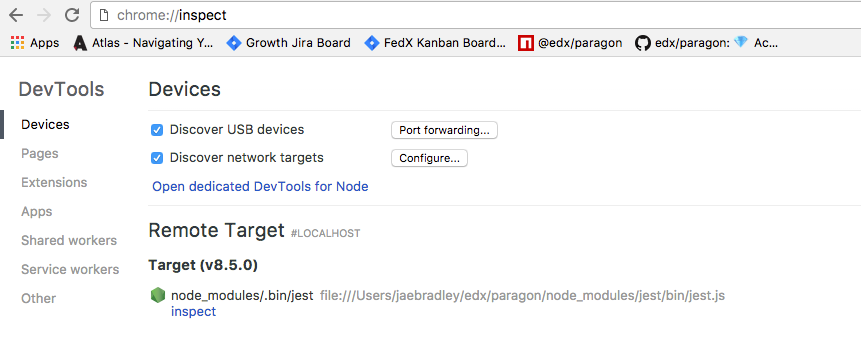

# Paragon

[](https://github.com/openedx/paragon/actions/workflows/release.yml)
[](@edx/paragon)


[](https://codecov.io/gh/edx/paragon)
[](https://www.npmjs.com/package/@edx/paragon)

## Purpose

Paragon is a pattern library containing [accessible](https://www.w3.org/WAI/standards-guidelines/aria/) React components and a SCSS foundation built on Twitter Bootstrap. Paragon is developed for the [Open edX](https://openedx.org/) platform.

Documentation lives at https://paragon-openedx.netlify.app/.

## Getting Started

### React Components

Paragon components require React 16 or higher. To install Paragon into your project:

In terminal:

```
npm i --save @edx/paragon
```

In your React project:

```
import { ComponentName } from '@edx/paragon';
```

#### SCSS Foundation

Usage for Open edX and others:

**index.scss**

```
// ... Any custom SCSS variables should be defined here
@import '~@edx/paragon/scss/core/core.scss';
```

Usage on with `@edx/brand`:

**index.scss**

```
@import '~@edx/brand/paragon/fonts.scss';
@import '~@edx/brand/paragon/variables.scss';
@import '~@edx/paragon/scss/core/core.scss';
@import '~@edx/brand/paragon/overrides.scss';
```

Note that including fonts will affect performance.  In some applications may choose not to load the custom font to keep it highly performant.

## Getting Help

Please reach out to the Paragon Working Group (PWG):

* Open edX Slack ([request an invite](https://openedx.org/slack)): [#wg-paragon](https://openedx.slack.com/archives/C02NR285KV4)
* [Github Issues](https://github.com/openedx/paragon/issues/new?template=blank-issue.md)
* [Weekly PWG Meeting](https://calendar.google.com/calendar/embed?src=c_v86shrnegshsqgp4fj2k94u7bc%40group.calendar.google.com&ctz=America%2FNew_York)

## Internationalization

Paragon supports internationalization for its components out of the box with the support of [react-intl](https://formatjs.io/docs/react-intl/). You may view translated strings for each component on the documentation website by switching languages in the settings.

Due to Paragon's dependence on ``react-intl``, that means that your whole app needs to be wrapped in its provider, e.g.:

```javascript
  import { IntlProvider } from 'react-intl';
  import { messages as paragonMessages } from '@edx/paragon';

  ReactDOM.render(
    <IntlProvider locale={usersLocale} messages={paragonMessages[usersLocale]}>
      <App />
    </IntlProvider>,
    document.getElementById('root')
  )
```

Note that if you are using ``@edx/frontend-platform``'s ``AppProvider`` component, you don't need a separate context as `IntlProvider` is already included; you would only need to add Paragon's i18n messages like this:

```javascript
  import { APP_READY, subscribe, initialize } from '@edx/frontend-platform';
  import { AppProvider } from '@edx/frontend-platform/react';
  import { messages as paragonMessages } from '@edx/paragon';
  import App from './App';
  // this is your app's i18n messages
  import appMessages from './i18n';

  subscribe(APP_READY, () => {
    ReactDOM.render(
      <AppProvider>
        <App />
      </AppProvider>,
      document.getElementById('root')
    )
  })

  initialize({
    // this will add your app's messages as well as Paragon's messages to your app
    messages: [
      appMessages,
      paragonMessages,
    ],
    // here you will typically provide other configurations for you app
    ...
  });
```

## Contributing

Please refer to the ["How to Contribute"](https://openedx.org/r/how-to-contribute) documentation and [Code of Conduct](https://openedx.org/code-of-conduct/) from Open edX.

The Paragon Working Group accepts bug fixes, new features, documentation, and security patches. You may find open issues [here](https://github.com/openedx/paragon/issues) or by visiting the Paragon Working Group [project board](https://github.com/orgs/openedx/projects/43/views/15).

If you'd like to contribute a new component or update an existing component, please consider reaching out to the Paragon Working Group via the channels [described above](#getting-help) to propose your changes.

The Paragon Working Group looks forward to your contributions! 💎

### Development

#### Developing locally against a micro-frontend (MFE)

If you want to test the changes with local MFE setup, you need to create a "module.config.js" file in your MFE's directory containing local module overrides. After that the webpack build for your application will automatically pick your local version of Paragon and use it. The example of module.config.js file looks like this (for more details about module.config.js, refer to the [frontend-build documentation](https://github.com/openedx/frontend-build#local-module-configuration-for-webpack).):

```javascript
module.exports = {
  /*
  Modules you want to use from local source code. Adding a module here means that when 
  your MFE runs its build, it'll resolve the source from peer directories of the app.

  moduleName: the name you use to import code from the module.
  dir: The relative path to the module's source code.
  dist: The sub-directory of the source code where it puts its build artifact. Often "dist".
  */
  localModules: [
    { moduleName: '@edx/paragon/scss/core', dir: '../src/paragon', dist: 'scss/core' },
    { moduleName: '@edx/paragon/icons', dir: '../src/paragon', dist: 'icons' },
    // Note that using dist: 'dist' will require you to run 'npm build' in Paragon
    // to add local changes to the 'dist' directory, so that they can be picked up by the MFE.
    // To avoid doing that you can use dist: 'src' to get any local changes hot reloaded on save in the MFE.
    { moduleName: '@edx/paragon', dir: '../src/paragon', dist: 'dist' },
  ],
};
```

Then, when importing Paragon's core SCSS in your MFE the import needs to begin with a tilde `~` so that path to your local Paragon repository gets resolved correctly: `@import "~@edx/paragon/scss/core";`

#### Internationalization

When developing a new component you should generally follow three rules:
1. The component should not have **any** hardcoded strings as it would be impossible for consumers to translate it
2. Internationalize all default values of props that expect strings, i.e.
   
   - For places where you need to display a string, and it's okay if it is a React element use ``FormattedMessage``, e.g. (see [Alert](src/Alert/index.jsx) component for a full example)
   
      ```javascript
      import { FormattedMessage } from 'react-intl';
      
      <FormattedMessage 
        id="pgn.Alert.closeLabel"
        defaultMessage="Dismiss"
        description="Label of a close button on Alert component"
      />
      ```
     
   - For places where the display string has to be a plain JavaScript string use ``formatMessage``, this would require access to ``intl`` object from ``react-intl``, e.g.
      
      - For class components use ``injectIntl`` HOC

          ```javascript
          import { injectIntl } from 'react-intl';
          
          class MyClassComponent extends React.Component {
            render() {
              const { altText, intl } = this.props;
              const intlAltText = altText || intl.formatMessage({
                id: 'pgn.MyComponent.altText',
                defaultMessage: 'Close',
                description: 'Close label for Toast component',
              });
              
              return (
                <IconButton
                  alt={intlCloseLabel}
                  onClick={() => {}}
                  variant="primary"
                />
              )
            }
          }
          
          export default injectIntl(MyClassComponent);
          ```

      - For functional components use ``useIntl`` hook

          ```javascript 
          import { useIntl } from 'react-intl';
    
          const MyFunctionComponent = ({ altText }) => {
            const intls = useIntl();
            const intlAltText = altText || intl.formatMessage({
              id: 'pgn.MyComponent.altText',
              defaultMessage: 'Close',
              description: 'Close label for Toast component',
            });
    
            return (
              <IconButton
                alt={intlCloseLabel}
                onClick={() => {}}
                variant="primary"
              />
            )
          
          export default MyFunctionComponent;
          ```
      
   **Notes on the format above**:
   - `id` is required and must be a dot-separated string of the format `pgn.<componentName>.<subcomponentName>.<propName>`
   - The `defaultMessage` is required, and should be the English display string.
   - The `description` is optional, but highly recommended, this text gives context to translators about the string.


3. If your component expects a string as a prop, allow the prop to also be an element since consumers may want to also pass instance of their own translated string, for example you might define a string prop like this:
   ```javascript
   MyComponent.PropTypes = {
     myProp: PropTypes.oneOfType([PropTypes.string, PropTypes.element]),
   };
   ```

#### Adding a new component

##### 1. Start the documentation site development server

The Paragon documentation site serves both as documentation and as a workbench to create your component within. To see your component in action, you need to run the documentation site locally.

```
npm install
npm start
```

##### 2. Create new component

To create new component run

```
npm run generate-component MyComponent
```

where `MyComponent` is your new component's name.

This will create a directory in `/src/` that will contain templates for all necessary files to start developing the component:
```
MyComponent
├── index.jsx
├── README.md
├── MyComponent.scss
├── _variables.scss
└── MyComponent.test.jsx
```

The script will also automatically export your component from Paragon.

##### 3. Start developing

`/src/MyComponent/index.jsx` is where your component lives, the file is created with the following template, edit it to implement your own component.

``` jsx
import React from 'react';
import PropTypes from 'prop-types';
import classNames from 'classnames';

const MyComponent = React.forwardRef(({ className, children }, ref) => (
  <div ref={ref} className={classNames('png__MyComponent', className)}>
    {children}
  </div>
));

MyComponent.defaultProps = {
  className: undefined,
};

MyComponent.propTypes = {
  /** A class name to append to the base element. */
  className: PropTypes.string,
  /** Specifies contents of the component. */
  children: PropTypes.node.isRequired,
};

export default MyComponent;

```

##### 4. (Optional) Add styles to your component.

If your component requires additional styling (which most likely is the case), edit created SCSS style sheet in your
component's directory `/src/MyComponent/MyComponent.scss` which by default contains an empty class for your component.

If you wish to use SASS variables (which is the preferred way of styling the components since values can be
easily overridden and customized by the consumers of Paragon), add them in `/src/MyComponent/_variables.scss` (this file should contain all variables specific to your component).
This way the variables will also get automatically picked up by documentation site and displayed on your component's page.

**Please note that you need to follow [Paragon's CSS styling conventions](docs/decisions/0012-css-styling-conventions).**

##### 5. Document your component

The documentation for your component lives in `src/MyComponent/README.md`. The documentation site scans this directory for markdown or mdx files to create pages. By default, the file is created with following content:

```` md
---
title: 'MyComponent'
type: 'component'
components:
- MyComponent
status: 'New'
designStatus: 'Done'
devStatus: 'Done'
notes: |
  Something special about this component
---

Describe your component here and give usage examples.

### Basic Usage

```jsx live
<MyComponent>
  Hello!
</MyComponent>
```

````

Some notes on the format above:

The top part of the markdown file is known as `frontmatter`. This metadata with consumed by the documentation site to control the title of the page and the doc site navigation.

- **title** controls the page title of the generated page
- **components** is a list of react components by displayName. This usually matches the name you define the component as in code. (In our example so far it is MyComponent). Components added to this list will be scanned by react-docgen for code comments and a props api table will be rendered at the bottom of the page.
- **categories** is a list of categories where this page will appear the documentation site menu.
- **status**, **designStatus**, **devStatus**, and **notes** appear in the http://localhost:8000/status page.

JSX code blocks in the markdown file can be made interactive with the live attribute. All paragon components and icons are in scope. (Note: the scope of this code block is controlled by `www/components/CodeBlock.jsx`).

##### 6. Navigate to your component on the doc site and start building

Visit the documentation at [http://localhost:8000](http://localhost:8000) and navigate to see your README.md powered page and workbench. Changes to the README.md file will auto refresh the page.

### ESLint

Paragon runs ESLint as a pre-commit hook. If your code fails linting, you will not be able to commit. To avoid hitting a giant-wall-of-linter-failures when you try to commit, we recommend [configuring your editor to run ESLint](http://eslint.org/docs/user-guide/integrations). To run ESLint in the console at any time, run the following:

```
$ npm run lint
```

Paragon's ESLint config is based off [eslint-config-edx](https://github.com/openedx/eslint-config-edx/tree/master/packages/eslint-config-edx), which itself is based off [eslint-config-airbnb](https://www.npmjs.com/package/eslint-config-airbnb). Paragon uses ESLint 3 (and will upgrade to v4 as soon as eslint-config-airbnb releases a supported version), which itself comes with a number of built-in rules. This configuration is highly opinionated and may contain some rules with which you aren't yet familiar, like [comma-dangle](http://eslint.org/docs/rules/comma-dangle), but rest assured, you're writing modern, best-practice JS 💅

One of the most powerful features of this ESLint config is its inclusion of [eslint-plugin-jsx-a11y](https://github.com/evcohen/eslint-plugin-jsx-a11y). This plugin actually enforces accessibility best practices at the _linter_ level. It will catch things reviewers might not notice, like [event handlers bound to noninteractive elements](https://github.com/evcohen/eslint-plugin-jsx-a11y/blob/master/docs/rules/no-noninteractive-element-interactions.md). Of course, it won't catch *all* accessibility violations, but it's a pretty good low-pass filter.

## Testing

Paragon uses [Jest](https://facebook.github.io/jest/) with [Enzyme](https://github.com/airbnb/enzyme) for tests and coverage. Both libraries are full-featured and very well supported.

### Unit Testing

[Jest](https://facebook.github.io/jest/) is an all-in-one test runner and assertion library created for use with React components. Jest's [API](https://facebook.github.io/jest/docs/en/api.html) is similar to Jasmine's and comes with functionality for mocking and spying as well. Check out [the docs](https://facebook.github.io/jest/docs/en/getting-started.html) for more details -- they are very comprehensive.

Paragon also uses Airbnb's [Enzyme](http://airbnb.io/enzyme/) library to help render our components within unit tests. Enzyme comes with a number of utilities for shallow rendering, mounting components, querying the DOM, simulating DOM events, and querying React components themselves. Read [the docs](http://airbnb.io/enzyme/docs/api/index.html) for more details.

To run the unit tests, run:

```
npm run test
```

To add unit tests for a component, create a file in your component's directory named `<ComponentName>.test.js`. Jest will automatically pick up this file and run the tests as part of the suite. Take a look at [Dropdown.test.jsx](https://github.com/openedx/paragon/blob/master/src/Dropdown/deprecated/Dropdown.test.jsx) or [CheckBox.test.jsx](https://github.com/openedx/paragon/blob/master/src/CheckBox/CheckBox.test.jsx) for examples of good component unit tests.

#### Run Unit Tests in Chrome DevTools Inspector

To run the unit tests in the Chrome DevTools inspector, run:

```
npm run debug-test
```

Then, open `chrome://inspect` in your Chrome browser and select the "node_modules/.bin/jest" target to open the Chrome DevTools. You can set breakpoints in Chrome DevTools or insert a `debugger;` statement into the code to pause execution at that point.



### Snapshot Testing

Jest has built-in [snapshot testing](http://facebook.github.io/jest/docs/en/snapshot-testing.html#snapshot-testing-with-jest) functionality which serves as a good means of smoketesting components to ensure they render in a predictable way.

When you modify components or stories (or add new components or stories), make sure to update the snapshots or else the snapshot tests will fail. It's easy to do -- just run:

```
$ npm run snapshot
```

If the snapshot tests fail, it's generally pretty easy to tell whether it's happening because of a bug or because the snapshots need to be updated. Don't be afraid to inspect the test output for clues!

### Coverage

Paragon measures code coverage using Jest's built-in `--coverage` flag and report it via [Codecov](https://codecov.io/gh/edx/paragon). Shoot for 100% test coverage on your PRs, but use your best judgment if you're really struggling to cover those last few lines. At the very least, don't *reduce* total coverage. Codecov will fail your build if your PR reduces coverage.

### Example app

Paragon components can have different behavior in the MFE environment. `example` app in the project root allows you to test new changes inside the MFE environment.

Steps to install the `example` app.

1. `npm install` to install dependencies.
2. Launch any devstack. It is required for MFE to login into the system and set up configs.
3. `npm run start-example-mfe` to start the app.
4. Go to the `example/src/MyComponent.jsx` and use Paragon components inside the MFE environment.

## Semantic Release

Paragon uses the [`semantic-release` package](https://github.com/semantic-release/semantic-release) to automate its release process (creating Git tags, creating GitHub releases, and publishing to NPM).

Preview next release version from Pull Requests
*****

As a convenience, the "Node.js CI / build (push)" check on Pull Requests includes a step to analyze the commit(s) and outputs a preview of what version semantic-release will publish if a PR gets merged. This is done using the "--dry-run" option for the semantic-release CLI, which will skip the publish/release steps. Look for a message in this CI step along the lines of "The next release version is <NEXT_RELEASE_VERSION>".

### Commit Messages

[`semantic-release` analyzes commit messages to determine whether to create a `major`, `minor`, or `patch` release](https://github.com/semantic-release/semantic-release#default-commit-message-format) (or to skip a release).
Paragon currently uses [the default conventional Angular changelog rules](https://github.com/conventional-changelog/conventional-changelog/tree/master/packages/conventional-changelog-angular) which means that there are **3** commit types that will trigger a release:
1. `feat` (`minor` release)
2. `fix` (`patch` release)
3. `perf` (`patch` release)

[There are other commit types](https://github.com/conventional-changelog/commitlint/blob/master/%40commitlint/config-angular-type-enum/index.js#L1-L12) that will not trigger a release that you can use at your own discretion. Suggested prefixes are `docs`, `chore`, `style`, `refactor`, and `test` for non-changelog related tasks.

#### Breaking Changes

Any of the previous `3` commit types **combined with `BREAKING CHANGE` in the commit message body** will trigger a `major` version release.

##### Example Breaking Change commit message

```
perf(pencil): remove graphiteWidth option

BREAKING CHANGE: The graphiteWidth option has been removed. The default graphite width of 10mm is always used for performance reason.
```

## Treeshaking

Paragon is distributed on npm as ES6 modules.  This means that webpack can use treeshaking on any Paragon components that a consuming app is not using, resulting in greatly reduced bundle sizes.

To get treeshaking to work, your app may require some updates - most notably, Babel 7.  See this PR for an example of the changes necessary to update an app to take advantage of treeshaking with Paragon: https://github.com/openedx/frontend-app-payment/pull/48

## People

The assigned maintainers for this component and other project details may be found in [Backstage](https://backstage.openedx.org/catalog/default/component/paragon). Backstage pulls this data from the `catalog-info.yml` file in this repository.

## Reporting Security Issues
Please do not report security issues in public. Please email security@edx.org.

We tend to prioritize security issues which impact the published `@edx/paragon` NPM library more so than the [documentation website](https://paragon-openedx.netlify.app/) or example React application.

## Design Tokens

Design tokens are all the values needed to build and maintain a design system — spacing, color, typography, object styles, etc. They can represent anything defined by the design: color as an RGB value, opacity as a number, spacing as a REM value. They are used instead of hard-coded values to provide flexibility and uniformity across the application.

By defining style properties as tokens, we can transform the styles into various implementations compatible with different platforms or formats as our use cases expand (e.g., transforming tokens to CSS variables, CSS utility classes, etc.).

### Theming with design tokens

Paragon uses [style-dictionary](https://github.com/amzn/style-dictionary) to build design tokens into CSS variables that are included in the package. Read more in [design tokens README](tokens/README.md).

#### Compiling CSS from design tokens for Paragon contributions (in this repo)
1. **`npm install`.** Install dependencies, including `style-dictionary`.
2. Make changes to design token(s).
3. **`npm run build-scss`.** Transforms the tokens to CSS variables and CSS utility classes, and generates `core.css` and `light.css` output files.
    - `light.css`. CSS variable definitions for colors in the light theme variant.
    - `core.css`. Contains the majority of Paragon/Bootstrap foundational styles for layout, components, etc. Consumes CSS variables defined by `light.css`.
4. Test changes locally (e.g., running the documentation website, the example MFE app, etc.).
5. Ensure changes to `core.css` and `light.css` are committed & released to NPM (which also "releases" them on versioned public CDNs for NPM packages).
6. Consuming applications would inject the `core.css` and `light.css` theme files into their applications via a mechanism similar to https://github.com/openedx/frontend-platform/pull/440 (ideally pulling from a public CDN for NPM packages, but falling back to locally installed copies, if needed).

#### Compiling CSS from design tokens for `@edx/brand` theme authors (in `@edx/brand` repos)
1. **`npm install`.** Install dependencies, including `@edx/paragon`.
2. Create tokens that will override Paragon's default tokens (matching same JSON schema).
3. **`npm run build-scss`.** This `@edx/brand` repo will have a new NPM script that utilizes a new CLI exported by `@edx/paragon` which exposes the `build-tokens.js` script (or possibly another if we end up needing one for the brand packages to run specifically, TBD) for `@edx/brand` consumers.
    - The intent of running this command is to effectively deep merge the tokens defined in Paragon's default tokens with the override tokens defined by `@edx/brand`, generating its own `core.css` and `light.css` output files (exact output files still a TBD) containing CSS variable overrides based on the token overrides.
5. Ensure any changes to the generated `core.css` and `light.css` files are committed & released to NPM (which also "releases" them on versioned public CDNs for NPM packages).
    - _Note: It is a bit unclear still in the above linked implementation POC for `@edx/frontend-platform` how it would integrate with `@edx/brand` in this way. Open to suggestions/feedback/ideas here._
